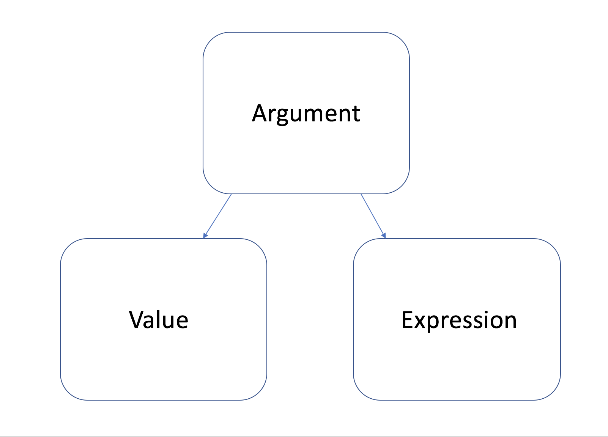

```{r,echo=FALSE, message=FALSE, warning=FALSE}
library(dplyr)
```

## whoami

Data scientist @ funda

Background:

Applied Statistics

Previously in consulting and banking

## whoami

<picture mountain>

## whoami

<picture Juul>

## whoami

<gif Hadley>

## whoami

thatssorandom.com

@edwin_thoen

CRAN: padr, GGally, recipes

## Why do we love R so much for data-analysis?

- R is very interactive, Q&A with your data

## Why do we love R so much for data-analysis?

- R has fantastic functionalities for plotting

## Why do we love R so much for data-analysis?

- R is super rich in statistical models

## Why do we love R so much for data-analysis?

- We can program in R

## Why do we love R so much for data-analysis?

- We don't have to use R when using R 

## Why do we love R so much for data-analysis?

- We don't have to use R when using R 

We can do

```{r}
library(dplyr)
mtcars %>% mutate(cyl_drat = cyl + drat)
```

or


```{r}
mtcars_dt <- data.table::as.data.table(mtcars)
mtcars_dt[, cyl_drat := cyl + drat]
```

Instead of 

```{r}
mtcars$cyl_drat <- mtcars$cyl + mtcars$drat
```

## We all use NSE!

When you started using R, did you mix up?

```{r, eval=FALSE}
install.packages("padr")
```

and

```{r, eval=FALSE}
library(padr)
```

Or wondered why the `library(padr)` worked. Even when there is no variable callend`padr`?

## We all use NSE!

Apparantly, things that ought not to work, are working.

This results is a language full of magic (also in base):

```{r, eval = FALSE}
subset(mtcars, cyl == 6)

ggplot2::ggplot(mtcars, aes(mpg, drat)) +
  geom_point()

data.table::as.data.table(mtcars)[ ,mean(mpg), by = cyl]
```

## Why data analysts love it and cs people don't

R is designed to do data science. (Well, then it was still called statistics).

Flexibility to maximize insights.

Enable DSL creation to tailor make tools to solve a specific problem without overhead.

With flexibility comes ambiguity and responsibility.

## What is this talk about?


## What is standard in the first place?

```{r, error=TRUE}
my_val <- 123

my_func <- function(x) {
  x / 42 * 121
}

my_func(71)

my_func(my_val)

my_func(your_val)
```

## 


## What's in a NAME

By creating a variable we assign a **value** to a **name**.

```{r}
my_val <- 123
```

123 is the **value** that is bound to the **name** `my_val`.

Binding happens in an environment, in this case the global.

## What's in a NAME

```{r}
my_val <- 123
```

123 is the **value** that is bound to the **name** `my_val`.

Binding happens in an environment, in this case the global.

Just call my name, honey, I'll give you the value:

```{r}
my_val
```

## Lexical scoping

R starts looking for the value of name in the local environment.

```{r}
x <- "a variable in the global"
a_func <- function() {
  x <- "a variable in the local"
  x
}
a_func()
```

## Lexical scoping

When it can't find it locally, move up to the parent environment (where the function was created).

```{r}
z <- "a variable in the global"
another_func <- function() {
  z
}
another_func()
```

## Lexical scoping

Finally, an error is thrown when the variable can't be found.

```{r, error=TRUE}
nobody_loves_me <- function() {
  y
}
nobody_loves_me()
```

So this is standard evaluation in R. 

## Wait for it

When evaluating a name we look for the value bound to it. We err when we can't find it. 

We can also ask R to postpone judgement, by storing the request in a **name object**.

```{r}
quote(my_unknown_var) %>% class()
```

## Wait for it

When evaluating a name we look for the value bound to it. R errs when it can't find the value. 

We can also ask R to postpone judgement, by storing the request in a **name object**.

```{r}
quote(my_unknown_var) %>% class()
```

This is the act of **quoting**, saving something to be evaluated later.

## Wait for it

Quoted variable names are not evaluated. It doesn't matter if they don't exist.

```{r}
quated_var <- quote(wait_for_it)
quated_var
```

## Wait for it

Quoted variable names are not evaluated. It doesn't matter if they don't exist.

```{r}
quoted_var <- quote(wait_for_it)
quoted_var
```

## Wait for it

It will start looking for the value only when we ask to evaluate it.

```{r, error=TRUE}
eval(quoted_var)
```

## Wait for it

```{r}
wait_for_it <- "I finally have a value"
eval(quoted_var)
```

## Building our own select

```{r}
diy_select <- function(x, name) {
  eval(name, envir = x)
}

diy_select(mtcars, quote(cyl))

diy_select(mtcars, quote(vs))
```


## Not just names

We can quote the following things:

* *name*: the name of an R object

* *call*: calling of a function

* *pairlist*: something from the past you shouldn't bother about

* *literal*: evaluates to the value itself

## Expressions: "don't be another SQL"


## Call

Just like a **name**, a function **call** can be delayed by quoted.

```{r}
my_little_filter <- function(x, 
                             call) {
  x[eval(call, envir = x), ]
}

my_little_filter(mtcars, quote(cyl == 4)) %>% head(2)
```


## 


## Quoting inside the function

You'll never have to quote your function arguments when using a DSL.

```{r, eval = FALSE}
mtcars %>% select(cyl)
as.data.table(mtcars)[, cyl]
ggplot(mtcars, aes(cyl)) + geom_bar()
```

Why does R not throw an error? There is no `cyl` in the global...

## Lazy, lazy R


## Lazy, lazy R

```{r}
koala <- function(x, y) {
  x + 42
}

koala(3)
```

## Industrious Python

```{python, error=TRUE}
def koala(x, y):
  return(x + 42)

koala(3)
```

## Quoting inside a function

So, R doesn't make a fuz until it realy has to.

This allows quoting inside functions.

```{r, error=TRUE}
my_second_little_filter <- function(x, bare_call) {
  call <- quote(bare_call)
  x[eval(call, envir = x), ]
}

my_second_little_filter(mtcars, cyl == 4) %>% head(2)
```

Why isn't this working?

## Quoting inside a function

`quote` does literally quote the input, but we want to quote the value of the argument, not the name.

Here we need `substitute`:

```{r}
substitute_example <- function(x) {
  substitute(x)
}
substitute_example(cyl == 4)
substitute_example(cyl == 4) %>% class()
```


## That's a *promise*



## That's a *promise*

So all function arguments are quoted and stored in the promise, alongside the value.

`substitute` retrieves the expression.


## All together

```{r}
my_correct_second_little_filter <- function(x, bare_call) {
  call <- substitute(bare_call)
  x[eval(call, envir = x), ]
}

my_correct_second_little_filter(mtcars, cyl == 4) %>% head(1)
```


* The call `cyl == 4` on itself is invalid, there is no `cyl` variable in the globla.
* But, R refrains from judgement, stores it in a promise.
* `substitute` retrieves just the expression, which is the quoted call.
* This expression is evaluated within the environment of `x`.
* Here it is completely valid, because there is a `cyl` variable.

## Quoting strings

```{r}
func1 <- function() "Calling function 1"
func2 <- function() "Calling function 2"

func_caller <- function(nr) { 
  eval(parse(text = paste0("func", nr)))()
}

func_caller(1)
func_caller(2)
```

## An actual useful example

```{r}
get_source_data <- function(nr,
                            rerun = FALSE) {
  file_path <- paste0("data/source_data_", nr, ".Rdata")
  if (file.exists(file_path) && !rerun) {
    load(file_path)
  } else {
    assign(paste0("source_data_", nr), 
           parse(text = paste0("query_", nr)) %>% eval())
    save(list = paste0("source_data_", nr), file = file_path)
  }
  parse(text = paste0("source_data_", nr)) %>% eval()
}
```

## Tidyeval

The `tidyverse` is implemented using NSE.

```{r, eval=FALSE}
mtcars %>% select(cyl)
```

We now know that `cyl` gets somehow quoted by `select` and evaluated within the data frame.

But what if we want to wrap tidyverse code in a custom function?

## Tidyeval - custom function

This won't work

```{r, eval = FALSE}
my_grouping_func <- function(x, grouping_var) {
  x %>% 
    group_by(grouping_var) %>% 
    summarise(max_drat = max(drat))
}
my_tv_func(mtcars, cyl)
```

Why?

## Tidyeval - custom function

In order to get it to work:

* quote the variable, like in regular R
* unquote again before the argument is swallowed by the tidyverse function
* then tidyverse function can go back and quote it again

## Tidyeval - custom function

In order to get it to work:

* quote the variable upfront
* unquote again before the argument is swallowed by the tidyverse function
* then tidyverse function can go back and quote it again

```{r}
my_grouping_func <- function(x, grouping_var) {
  x %>% 
    group_by(!!grouping_var) %>% 
    summarise(max_drat = max(drat))
}
my_grouping_func(mtcars, quo(cyl))
```

## Tidyeval - custom function

Just like using `substitute` you can quote the arguments value with `enquo`.

```{r}
my_grouping_func <- function(x, grouping_var) {
  grouping_var_q <- enquo(grouping_var)
  x %>% 
    group_by(!!grouping_var_q) %>% 
    summarise(max_drat = max(drat))
}
my_grouping_func(mtcars, cyl)
```

