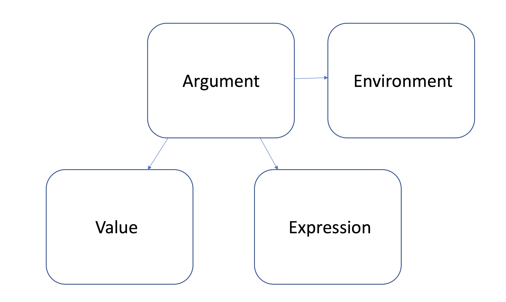

```{r,echo=FALSE, message=FALSE, warning=FALSE}
library(dplyr)
```

## whoami

<center></center>

## whoami

<center></center>

## whoami

<center></center>

## whoami

Data scientist @ funda

Applied Statistics

thatssorandom.com

@edwin_thoen

CRAN: padr, GGally, recipes

## What is this talk about?

<center></center>

## Lets show some hands

Who:

## Lets show some hands

Who:

* is very experienced in using NSE?

## Lets show some hands

Who:

* is very experienced in using NSE?
* applies it now and then?

## Lets show some hands

Who:

* is very experienced in using NSE?
* applies it now and then? 
* only knows it at face value?

## Lets show some hands

Who:

* is very experienced in using NSE?
* applies it now and then?
* only knows it at face value?
* is not really sure what it is?

## Why do we love R so much for data-analysis?

## Why do we love R so much for data-analysis?

We don't have to use R when using R!

```{r}
mtcars$cyl_drat <- mtcars$cyl + mtcars$drat
```

## Why do we love R so much for data-analysis?

We don't have to use R when using R!

```{r}
mtcars$cyl_drat <- mtcars$cyl + mtcars$drat
```

Instead of this, we can do

```{r}
library(dplyr)
mtcars <- mtcars %>% mutate(cyl_drat = cyl + drat)
```

or

```{r}
mtcars_dt <- data.table::as.data.table(mtcars)
mtcars_dt[, cyl_drat := cyl + drat]
```

## We all use NSE from the first day

When you started using R, did you mix up?

```{r, eval=FALSE}
install.packages("padr")
```

and

```{r, eval=FALSE}
library(padr)
```

## Domain Specific Languages

Apparantly, things that ought not to work, are working.

```{r, eval = FALSE}
subset(mtcars, cyl == 6)

ggplot2::ggplot(mtcars, aes(mpg, drat)) +
  geom_point()

data.table::as.data.table(mtcars)[ ,mean(mpg), by = cyl]
```

## Why should you care about how NSE works?

## Why should you care about how NSE works?

* Because you are a geek and can't stand not knowing :)

##

<center></center>

##

<center></center>


## Why should you care about how NSE works?

* Because you are a geek and can't stand not knowing :)
* Because most R users slip into tool design sooner or later.

## So what is Standard?

## What's in a NAME

By creating a variable we bind a **value** to a **name**.

```{r}
my_val <- 123
```

Binding happens in an environment, in this case the global.

## What's in a NAME

By creating a variable we bind a **value** to a **name**.

```{r}
my_val <- 123
```

Binding happens in an environment, in this case the global.

Just call my name, I'll give you the value:

```{r}
my_val
```

This is *evaluating* the variable name.

## Lexical scoping

R starts looking for the value of name in the environment the name is called in.

```{r}
x <- "a variable in the global"
a_func <- function() {
  x <- "a variable in the local"
  x
}
a_func()
```

## Lexical scoping

When it can't find it locally, move up to the parent environment (where the current env was created).

```{r}
z <- "a variable in the global"
another_func <- function() {
  z
}
another_func()
```

## Lexical scoping

Error is thrown when the variable can't be found.

```{r, error=TRUE}
nobody_loves_me <- function() {
  y
}
nobody_loves_me()
```

So this is standard evaluation in R. 

## Wait for it

Postpone judgement, store variable name in a **name object**.

```{r}
quote(wait_for_it)
quote(wait_for_it) %>% class()
```

## Wait for it

Postpone judgement, store variable name in a **name object**.

```{r}
quote(wait_for_it)
quote(wait_for_it) %>% class()
```

This is the act of **quoting**, saving a variable name to be evaluated later.

(**name** is also called **symbol**)

## Wait for it

Quoted variable names not evaluated. It doesn't matter if they don't exist.

```{r}
quoted_var <- quote(wait_for_it)
quoted_var
quoted_var %>% class()
```

## Wait for it

Look for the value only when we ask to evaluate it.

```{r, error=TRUE}
eval(quoted_var)
```

## Wait for it

```{r}
wait_for_it <- "I finally have a value"
eval(quoted_var)
```

## What is the use?

## What is the use?

We can evaluate the `name` in a different environment.

## Building our own `pull`

```{r}
dplyr::pull(mtcars, cyl)
```


## Building our own `pull`

```{r}
diy_pull <- function(x, name) {
  eval(name, envir = x)
}

diy_pull(mtcars, quote(cyl))
```

## Building our own `pull`

```{r}
diy_pull <- function(x, name) {
  eval(name, envir = x)
}

diy_pull(mtcars, quote(cyl))
```

A data frame is an environment too. Column names act as variables.

## 

<center></center>

## DSLs take "bares" 

```{r, eval = FALSE}
mtcars %>% select(cyl)
as.data.table(mtcars)[, cyl]
ggplot(mtcars, aes(cyl)) + geom_bar()
```

Why does R not throw an error? There is no `cyl` in the global...

## Quoting inside a function

Would this work?

```{r, eval=FALSE}
diy_pull <- function(x, bare_name) {
  name <- quote(bare_name)
  eval(name, env = x)
}
```

## Quoting inside a function

Would this work?

```{r, error=TRUE}
diy_pull_2 <- function(x, bare_name) {
  name <- quote(bare_name)
  eval(name, env = x)
}

diy_pull(mtcars, cyl)
```

## Quoting inside a function

`substitute` quotes the argument's content

```{r}
substitute_example <- function(x) {
  substitute(x)
}
substitute_example(cyl)
substitute_example(cyl) %>% class()
```

## Quoting inside a function

```{r, error=TRUE}
diy_pull <- function(x, bare_name) {
  name <- substitute(bare_name)
  eval(name, env = x)
}

diy_pull(mtcars, cyl)
```

## Not just names

We can quote the following things:

* *name*: the name of an R object

* *call*: calling of a function

* *pairlist*: something from the past you shouldn't bother about

* *literal*: evaluates to the value itself

## "don't be another SQL"

<center></center>

## Call

Just like a **name**, a function **call** can be delayed by quoting.

```{r}
my_little_filter <- function(x, 
                             call) {
  call_quoted <- substitute(call)
  retain_row  <- eval(call_quoted, envir = x)
  x[retain_row, ]
}

my_little_filter(mtcars, cyl == 4 & gear == 4) %>% head(2)
```

## But, but ... why?

## Lazy, lazy R

<center></center>

## Lazy, lazy R

```{r}
koala <- function(x, y) {
  x + 42
}

koala(3)
```

## Industrious Python

```{python, error=TRUE}
def koala(x, y):
  return(x + 42)

koala(3)
```

## 


## That's a *promise*



## That's a *promise*

The value slot is empty at promise creation.

Only when the argument's expression is evaluated in the function, we start looking for it. 

## That's a *promise*

The value slot is empty at promise creation.

Only when the argument's expression is evaluated in the function, we start looking for it. 

Remember `koala`?

```{r}
koala <- function(x, y) {
  x + 42
}
```

## Promising koala

When we call `koala` we create the following promise

```{r, eval = FALSE}
x_value <- 42
koala(x = x_value)
```

<center></center>

## Accessing the expression slot

That's how `subsitute` works!

Accesses the expression in the promise without evaluating it.

```{r}
subs_func <- function(val) {
  vals_expr <- substitute(val)
  deparse(vals_expr)
}
subs_func(anything_goes)
```

Note that `deparse` coerces the expression to a character. Its inverse is `parse`.

## Tidyeval

The `tidyverse` NSE dialect.

```{r, eval=FALSE}
mtcars %>% select(cyl)
```

We now know that `cyl` gets somehow quoted by `select` and evaluated within the data frame.

But what if we want to wrap tidyverse code in a custom function?

## Tidyeval - custom function

This won't work

```{r, eval = FALSE}
my_tv_func <- function(x, grouping_var) {
  x %>% 
    group_by(grouping_var) %>% 
    summarise(max_drat = max(drat))
}
my_tv_func(mtcars, cyl)
```

Why?

## Tidyeval - custom function

In order to get it to work:

* quote the variable upfront
* unquote again before the argument is swallowed by the tidyverse function
* then tidyverse function can go back and quote it again

## Tidyeval - custom function

In order to get it to work:

* quote the variable upfront
* unquote again before the argument is swallowed by the tidyverse function
* then tidyverse function can go back and quote it again

```{r, eval = FALSE}
my_tv_func <- function(x, grouping_var) {
  x %>% 
    group_by(!!grouping_var) %>% 
    summarise(max_drat = max(drat))
}
my_tv_func(mtcars, quo(cyl))
```

## Tidyeval - custom function

Just like using `substitute` you can quote the arguments value with `enquo`.

```{r}
my_grouping_func <- function(x, grouping_var) {
  grouping_var_q <- enquo(grouping_var)
  x %>% 
    group_by(!!grouping_var_q) %>% 
    summarise(max_drat = max(drat))
}
my_grouping_func(mtcars, cyl)
```

## Summary

<center></center>

## Summary

```{r}
my_filter <- function(x, bare_call) {
  call <- substitute(bare_call)
  x[eval(call, envir = x), ]
}

my_filter(mtcars, cyl == 4) %>% head(1)
```

* `cyl == 4` on itself is invalid, there is no `cyl` in the global.
* But, R refrains from judgement, stores it in a promise.
* `substitute` gets the expression, which is the quoted call.
* This expression is evaluated within the environment of `x`.
* Here it is completely valid, because there is a `cyl` column.

## Things not covered (extensively)

- quasiquotation

- quosures

- environments

## Thank You!

edwinthoen@gmail.com  

@edwin_thoen

github.com/EdwinTh/satRday

edwinth.github.io/blog/nse

edwinth.github.io/blog/dplyr-recipes


